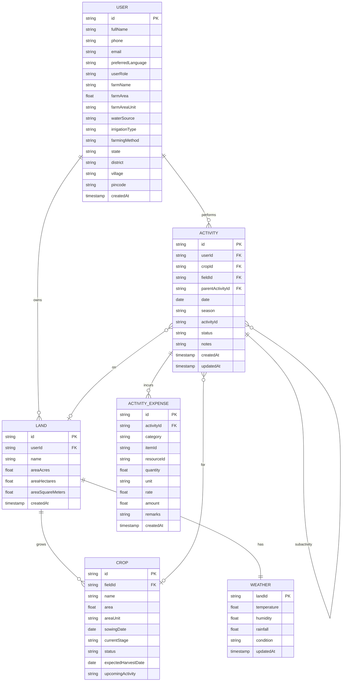

# Entity Relationship Diagram (ERD)

This document defines the data models and relationships for the Farm Management Application.

## 1. ER Diagram (Mermaid)

---

## 2. Entity Dictionary & Attributes

### 2.1 User
Represents a registered farmer or farm manager.
* **id** (PK): Unique identifier.
* **fullName**: Name of the user.
* **phone**: Contact phone number.
* **email**: Email address (optional).
* **preferredLanguage**: Language selected for localization.
* **userRole**: Role (e.g., `'Farmer'`, `'Farm Owner'`, `'Agronomist'`, `'Farm Worker'`).
* **farmName**: Overall name of the farm.
* **farmArea** / **farmAreaUnit**: Total land area of the farm.
* **waterSource** / **irrigationType**: Primary water source and setup.
* **farmingMethod**: e.g., `'Organic'`, `'Chemical'`, `'Mixed'`.
* **state** / **district** / **village** / **pincode**: Geographical details.
* **createdAt**: Timestamp of registration.

### 2.2 Land (SavedFarm)
A designated plot or field owned by the User.
* **id** (PK): Unique identifier.
* **userId** (FK): Links to the owning User.
* **name**: Name of the specific field (e.g., "North Field").
* **areaAcres** / **areaHectares** / **areaSquareMeters**: Size dimensions of the field.
* **createdAt**: Creation timestamp.

### 2.3 Crop (CropEntity)
A crop sown and cultivated on a specific Land/Field.
* **id** (PK): Unique identifier.
* **fieldId** (FK): Links to the Land/Field where it's planted.
* **name**: Crop type name (e.g., `'Wheat'`, `'Rice'`, `'Soybean'`).
* **area** / **areaUnit**: Dedicated area size for this crop within the field.
* **sowingDate**: Date of sowing.
* **currentStage**: Current stage of the crop lifecycle (e.g., `'Vegetative Growth'`, `'Flowering'`).
* **status**: Active, Completed, or Archived.
* **expectedHarvestDate**: Target harvest date.
* **upcomingActivity**: Summary/description of the next planned activity.

### 2.4 Weather
Stores localized weather information mapped to a Land/Field.
* **landId** (PK, FK): Primary key matching the Land ID.
* **temperature**: Current or forecasted temperature.
* **humidity**: Moisture percentage.
* **rainfall**: Precipitation levels.
* **condition**: General description (e.g., `'Sunny'`, `'Rainy'`).
* **updatedAt**: Timestamp of the last weather fetch.

### 2.5 Activity
Represents an action performed.
* **id** (PK): Unique identifier.
* **userId** (FK): The User who initiated/performed the action.
* **cropId** (FK, Nullable): Optional reference to a Crop.
* **fieldId** (FK, Nullable): Optional reference to a Land/Field.
* **parentActivityId** (FK, Nullable): Self-reference to another Activity. If set, this Activity acts as a **Subactivity**.
* **date**: Date of execution.
* **season**: Crop season (e.g., `'Kharif'`, `'Rabi'`).
* **activityId**: Type/name of the activity (e.g., `'Sowing'`, `'Irrigation'`).
* **status**: Execution state (e.g., `'Draft'`, `'In Progress'`, `'Completed'`).
* **notes**: General descriptions or remarks.
* **createdAt** / **updatedAt**: Timestamps.

### 2.6 Activity Expense
An expense item incurred as part of an Activity.
* **id** (PK): Unique identifier.
* **activityId** (FK): Links to the parent Activity.
* **category**: Expense type (e.g., `'Machine Rent'`, `'Labour'`, `'Seeds'`).
* **quantity** / **unit** / **rate**: Breakdown metrics.
* **amount**: Total calculated amount.
* **remarks**: Additional remarks.
* **createdAt**: Timestamp.

---

## 3. Relationships Explanation

1. **User - Land**: **One-to-Many**. A User owns multiple fields (Land), but a field belongs to one User.
2. **Land - Crop**: **One-to-Many**. A field can cultivate multiple crops over seasons or in mixed cropping, but each Crop record is associated with a specific field.
3. **Land - Weather**: **One-to-One**. Each land has a single localized weather forecast matching its location coordinate.
4. **User - Activity**: **One-to-Many**. A User logs and performs multiple Activities.
5. **Activity - Land / Crop**: **Zero/One-to-Many**. An Activity can optionally target a specific Land, a specific Crop, or neither (e.g., a general farm maintenance task).
6. **Activity - Subactivity (Self-Reference)**: **One-to-Many**. An Activity can contain multiple subactivities. This is represented by the `parentActivityId` field. If `parentActivityId` is not null, the activity acts as a Subactivity of the referenced parent Activity.
7. **Activity - Expense**: **One-to-Many**. An Activity can incur multiple expense items (e.g. seeds, fertilizers, tractor rental).