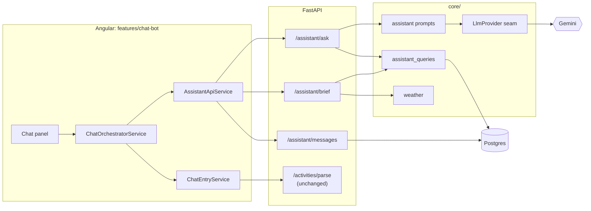
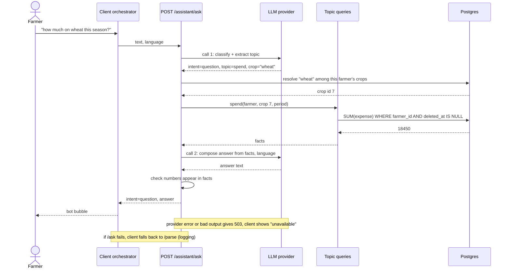
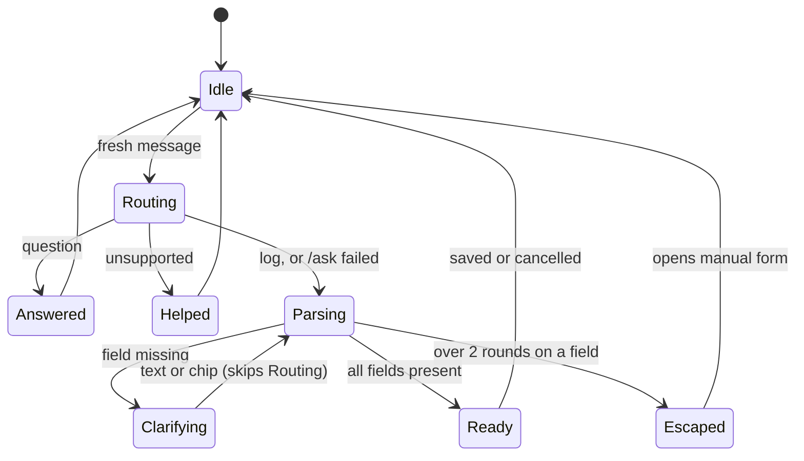
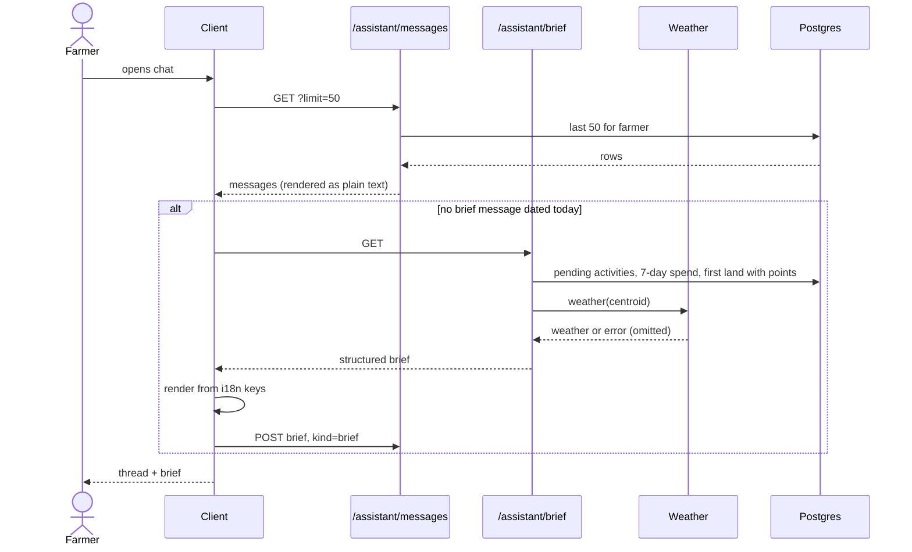
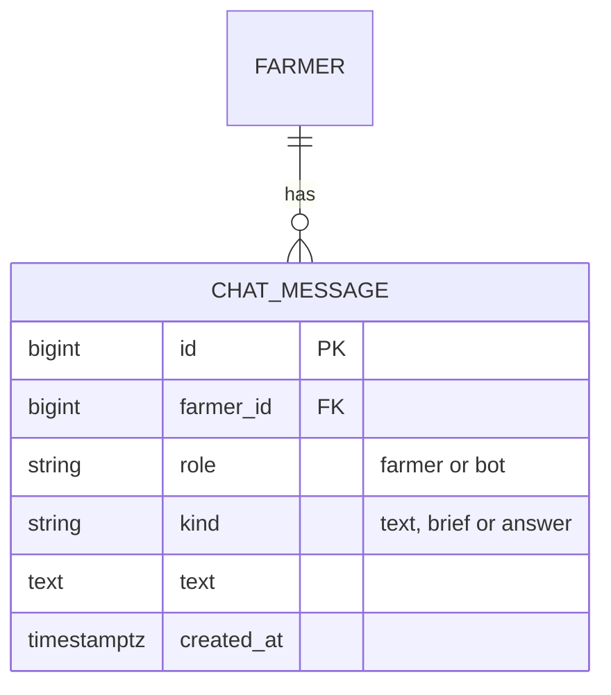

# Design

## Context

- Logging today: the client orchestrator (`chat-orchestrator.service.ts`) re-parses the accumulated text through `POST /api/v1/activities/parse`, then `decideNextStep` picks one clarification at a time. Conversation state lives in signals and dies on `reset()`.
- Backend already has a narrow LLM seam (`core/llm.py`: `LlmProvider.complete_json(prompt) -> dict`, Gemini, 503 on any failure), a prompt builder (`core/chat_entry.py`) that already takes a `language`, `GET /activities/summary` (aggregate SQL), `GET /weather?lat&lng`, and `Farmer.preferred_language`.
- `land` has GPS points (`LandPoint`), which gives coordinates for weather; nothing stores a farm location otherwise.
- See proposal.md for motivation and scope; requirements are in `specs/`.

## Goals / Non-Goals

**Goals:**
- Add routing, answers, brief and history without changing the logging parse contract or review popup.
- Keep tenant isolation server-side and make every figure in an answer traceable to a backend query.
- Keep provider cost bounded (no LLM call on open, on history load, or on chip taps).

**Non-Goals:**
- A general agent/tool-calling framework, streaming responses, or multi-turn memory fed back into the model (each question is answered from fresh data, not from earlier turns).
- Moving the logging orchestration to the server.

## Architecture

## Decisions

**1. One new router, `/api/v1/assistant`.** `POST /ask` (route + answer), `GET /brief`, `GET /messages`, `POST /messages`, `DELETE /messages`. `/activities/parse` stays as is. *Alternative:* extend `/parse` with an intent field — rejected, it would change a shipped contract and mix a 422 "not understood" with legitimate questions.

**2. `/ask` does classification and answering in a fixed pipeline, not free-form tool use.**
1. LLM call #1 returns JSON `{intent: log|question|unsupported, query?: {topic, crop?, land?, period?}}` where `topic` is a closed enum (`spend`, `spend_by_category`, `recent_activities`, `pending_activities`, `lands`, `crops`, `weather`). Crop/land arrive as the farmer's words.
2. `log` → respond `{intent:"log"}` and the client continues with `/parse`. `unsupported` → respond with intent only; the client shows a localized fixed "what I can help with" message (no second LLM call).
3. `question` → backend resolves names against **that farmer's** lands/crops (reusing the resolver's matching), runs the fixed SQL for the topic, and passes only the resulting facts to LLM call #2, which returns `{answer}` in the requested language. Ambiguous/unknown names short-circuit to `{intent:"question", needs_clarification:{field, options}}` with no second call.
*Why:* the model never writes SQL or picks arbitrary tables; the topic enum is the whole attack surface; answers cannot contain figures the backend did not produce (prompt tells the model to use only the supplied facts, numbers are also validated present in the facts before returning). *Alternative:* Gemini function calling — rejected: provider-specific, breaks the `complete_json` seam, more moving parts for seven fixed topics.

Sequence for a fresh message:

**3. Routing happens on the server, client only bypasses it during clarification.** The orchestrator already knows `currentField`; when set, it skips `/ask` and calls `/parse` as today. On `/ask` failure the client falls back to `/parse` (spec: routing failure falls back to logging). Cost: fresh messages that are logs pay one extra LLM call. *Alternative:* client-side keyword heuristic — rejected: brittle in Hindi/Marathi/Hinglish.

Client conversation states (extends the existing orchestrator):

**4. Daily brief is deterministic and structured.** `GET /brief` returns data (`weather?`, `pending: {count, next[]}`, `spend_7d`, `has_data`), no text and no LLM. The client renders it from i18n keys with params (en/hi/mr), so it works when the provider is down. Weather uses the centroid of the first land that has points; none → omitted. Weather failure → omitted (endpoint swallows the error, logs it).
"Once per day": the brief is saved as a normal bot message with `kind="brief"`. On open the client fetches `/brief` only if the restored history has no `brief` message dated today (farmer-local date from the client). This avoids extra server state.

Open sequence (brief + history):

**5. History = one rolling conversation per farmer, table `chat_message`.** Columns: `id`, `farmer_id` (tenant scoped like `TenantScopedBase`), `role` (`farmer|bot`), `kind` (`text|brief|answer`), `text`, `created_at`; index `(farmer_id, id desc)`. Chips and the review action are **not** stored (spec: stale controls render as plain text). The **client** appends messages (`POST /messages`, batch of 1–2 per turn) so logging turns and answer turns persist uniformly; `/ask` stays stateless. Cap of 500: trimmed inside the append transaction. Load: `GET /messages?limit=50&before=<id>` newest-first, reversed by the client. `DELETE /messages` clears all (hard delete — these are the farmer's own words; no soft-delete needed).
*Alternative:* `/ask` persists both turns — rejected: logging turns never hit `/ask`, so two write paths.
Persistence failures are swallowed client-side (logged, chat continues).

**6. Language.** Client sends `language` = `TranslateService.currentLang`; backend uses it if in `{en,hi,mr}`, else `Farmer.preferred_language`, else `en`. Only LLM answers depend on it; all other bot text uses existing i18n keys.

**7. Privacy.** Farmer text goes to the provider already (parse). `/ask` additionally sends the farmer's *aggregated facts* (totals, names of their own crops/lands, activity titles) — never other farmers' rows and never auth identifiers. Server logs record keys/intent/topic, not message text or facts (same rule as `chat_entry` logging).

## Risks / Trade-offs

- [Misrouted message: a log treated as a question, or vice versa] → `unsupported`/`log` fallbacks; a `question` that names nothing answerable returns the "what I can help with" text; the farmer can always use the manual form.
- [Extra LLM latency/cost on every fresh message] → single small JSON call at temperature 0; measure in the final sub-issue; a cheap pre-check (e.g. leading digits/amount patterns) can skip routing later without spec change.
- [Model states a wrong number] → numbers in the answer are checked against the supplied facts; on mismatch, fall back to a deterministic templated sentence from the facts.
- [History grows / privacy of stored text] → 500-message cap, clear-all endpoint, per-farmer scoping tested; no message text in logs.
- [Migration on Neon] → additive table only; rollback = drop the table (no other table references it).
- [Weather needs coordinates] → farmers whose lands have no points get a brief without weather; acceptable.

## Migration Plan

Additive Alembic migration `0005_chat_message`. Deploy backend first (new endpoints unused), then frontend. Rollback: revert frontend (old bot works against unchanged `/parse`), leave the table.
