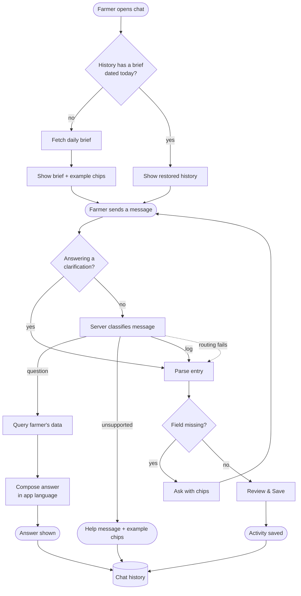

# Proposal

Board issue: parent epic **#285**; sub-issues #286–#291 (one per task group in `tasks.md`).

## Why

The chat bot can only do one thing: turn a sentence into an activity entry. A farmer cannot ask it anything ("how much have I spent on wheat?", "what's pending on Plot 2?"), it says nothing until spoken to, it forgets everything when the panel closes, and its replies are fixed strings. Farmers already trust it as the quickest way in; making it a personal assistant gets them answers from data the app already holds.

## What Changes

- The bot decides per message whether the farmer is **logging** something or **asking** something, and routes accordingly. Logging keeps today's clarify → review → save flow untouched.
- New **question answering** over the farmer's own data: spend (by crop/land/category/period), recent and pending activities, lands and crops, and weather for a land. Answers are composed from facts the backend queried for that farmer only — the model never writes queries and never sees other farmers' data.
- New **daily brief**: when the panel opens, the bot greets with today's weather for the farmer's land, work still pending, and recent spend. Computed server-side without an LLM call.
- Bot replies (answers, brief, clarifications) follow the **app language** (en/hi/mr).
- **Chat history is persisted** server-side per farmer, restored when the panel opens, and can be cleared by the farmer. The panel's "nothing is saved yet" disclaimer is replaced.

### End to end

## Capabilities

### New Capabilities
- `assistant-intent-routing`: classifying a farmer message as log / question / unsupported and routing it, without disturbing the logging flow.
- `assistant-data-answers`: answering questions about the farmer's own farm data in the farmer's language.
- `assistant-daily-brief`: the proactive greeting shown when the chat opens.
- `assistant-chat-history`: server-side persistence, restore and clearing of the conversation.

### Modified Capabilities
<!-- None: no existing chat-bot spec exists under openspec/specs/. -->

## Impact

- **Backend**: new `assistant` router (`/api/v1/assistant/...`), a `chat_message` table + Alembic migration, an LLM prompt/tool layer next to `core/chat_entry.py`, extra read queries over `activity`, `activity_expense`, `land`, `crop`. `/activities/parse` unchanged. OpenAPI export and generated contracts regenerate.
- **Frontend**: `features/chat-bot` (orchestrator, models, panel), a new assistant API service, i18n keys in en/hi/mr.
- **Cost/ops**: one extra LLM call per fresh farmer message (routing) and one more per question (answer composition). Uses the existing Gemini provider seam; no new dependency.

## Non-Goals

- Voice input/output, image or photo questions.
- Reminders, to-dos, push notifications or scheduled messages (brief appears only on open).
- Farming/agronomy advice (pest, dosage, "should I spray") — answers are limited to the farmer's recorded data and weather facts.
- Writing data from a question (create/edit/delete stay in the logging flow and manual forms).
- Cross-device real-time sync of an open conversation.
- Changing the logging parse contract or the review popup.
