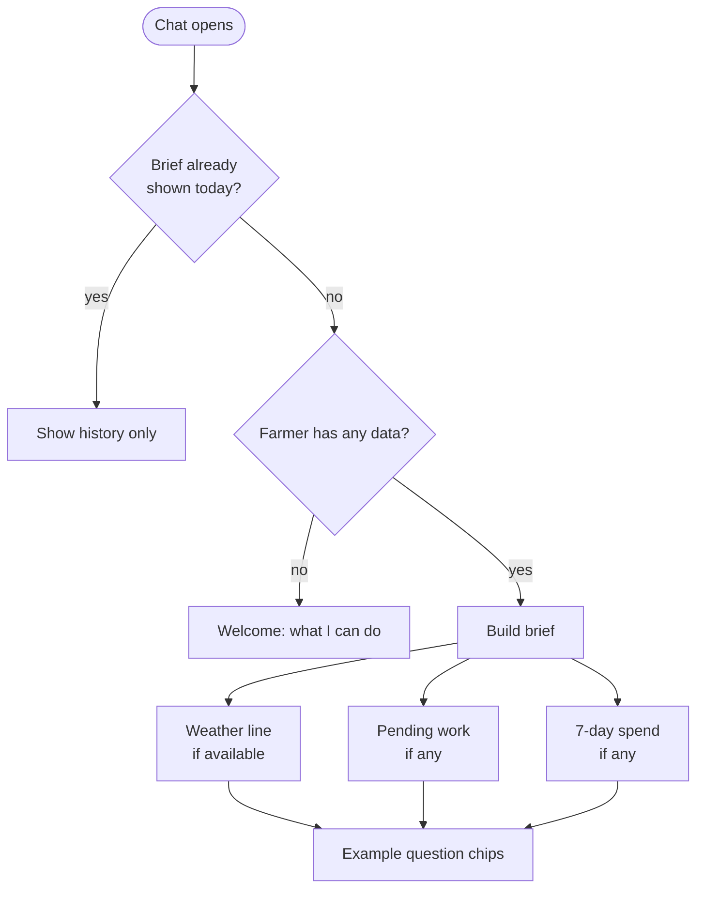

# Spec Delta

## Purpose

Greets the farmer with what matters today when they open the chat, so the assistant is useful before they type anything.

## ADDED Requirements

### Requirement: Brief on open
When the farmer opens the chat, the system SHALL show a brief containing today's weather for their land, the count and next items of pending activities, and the expense total for the last 7 days, each only when there is data for it.

#### Scenario: Farmer with data
- **WHEN** the farmer has a land with coordinates, two pending activities and expenses in the last 7 days
- **THEN** the brief shows weather, "2 pending" with the nearest items, and the 7-day spend

#### Scenario: New farmer
- **WHEN** the farmer has no lands, activities or expenses
- **THEN** the brief is a short welcome that says what the assistant can do, with no empty sections

### Requirement: Brief offers example questions
The brief SHALL end with tappable example questions (spend this month, what is pending) that are sent to the assistant as if typed.

#### Scenario: Tap an example
- **WHEN** the farmer taps "What did I spend this month?" under the brief
- **THEN** it appears as the farmer's message and is answered per `assistant-data-answers`

### Requirement: Brief is computed without the model
The system SHALL compute the brief from stored data and weather without calling the language model, and SHALL render it in the app language from translated text.

#### Scenario: Model provider down
- **WHEN** the model provider is unavailable
- **THEN** the brief still loads

### Requirement: Brief at most once per day
The system SHALL show the brief at most once per calendar day per farmer and SHALL NOT fetch it on every open.

#### Scenario: Reopened the same day
- **WHEN** the farmer closes and reopens the chat later the same day
- **THEN** the earlier brief is part of the restored history and no new brief is added or fetched

### Requirement: Weather unavailable
If weather cannot be obtained, the brief SHALL omit the weather line rather than fail.

#### Scenario: Weather error
- **WHEN** the weather lookup fails
- **THEN** the brief shows its other sections without an error message
