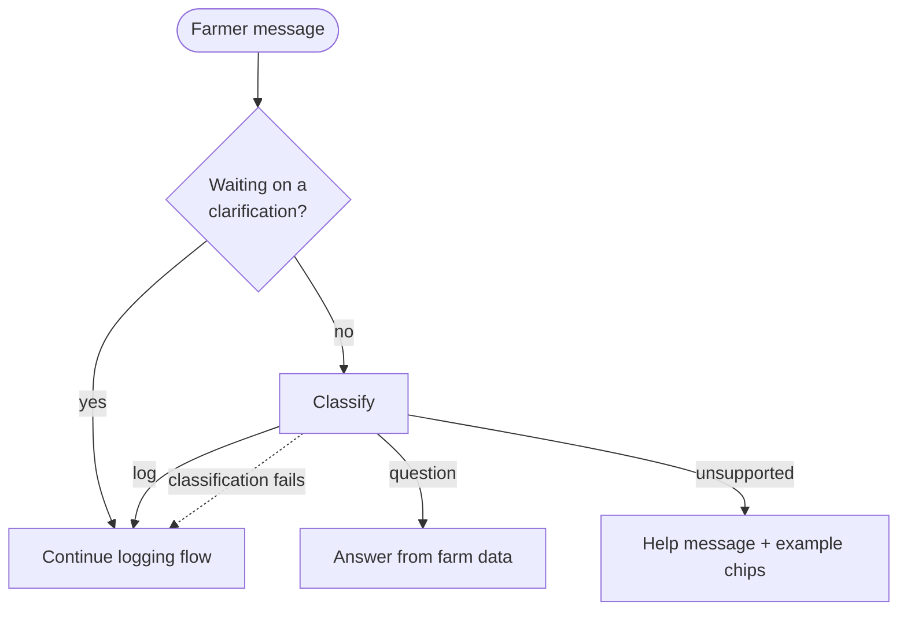

# Spec Delta

## Purpose

Decides whether a farmer's chat message is a request to log an activity or a question about their farm, so the bot can do the right thing without the farmer choosing a mode.

## ADDED Requirements

### Requirement: Each fresh message is classified
The system SHALL classify each farmer message that is not an answer to an outstanding clarification as exactly one of `log`, `question` or `unsupported`.

#### Scenario: Logging sentence
- **WHEN** the farmer sends "sprayed pesticide on Plot 1 today, paid 500 for labour"
- **THEN** the message is classified `log`
- **AND** the existing parse → clarify → review flow runs unchanged

#### Scenario: Question
- **WHEN** the farmer sends "how much did I spend on wheat this month?"
- **THEN** the message is classified `question` and is answered per `assistant-data-answers`

#### Scenario: Out of scope message
- **WHEN** the farmer sends something that is neither a log nor a question about their farm (e.g. "tell me a joke")
- **THEN** the message is classified `unsupported`
- **AND** the bot replies, in the farmer's language, with a short statement of what it can help with and tappable example questions

### Requirement: Clarification answers bypass classification
While the bot is waiting for the farmer to clarify a field of an entry being logged, the system SHALL treat the next message or chip tap as part of that entry and SHALL NOT classify it.

#### Scenario: Chip tap during clarification
- **WHEN** the bot has asked "Which land is this for?" and the farmer taps a land chip
- **THEN** the entry is re-parsed with the correction and no classification call is made

### Requirement: Routing failure falls back to logging
If classification cannot be completed, the system SHALL fall back to the logging flow rather than blocking the farmer.

#### Scenario: Provider unavailable
- **WHEN** the classification request fails because the model provider is unavailable
- **THEN** the message is handled as `log`
- **AND** the existing unavailable/manual-form messaging applies if that also fails
