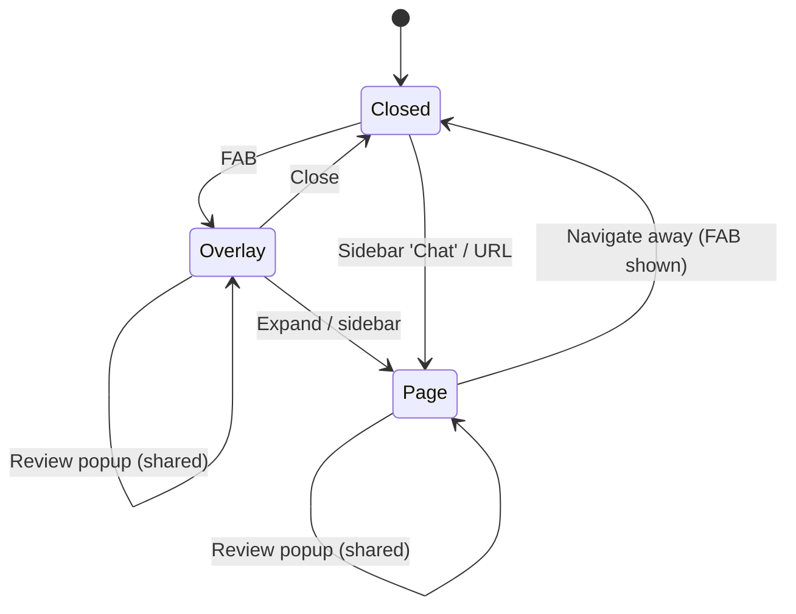

# Design

## Context

`ChatBotContainerComponent` is mounted once in `AppLayout`'s authenticated branch. It provides `ChatOrchestratorService` at its own level and owns three pieces of UI state: `open` (overlay), `reviewOpen` (review popup) and the escape-hatch effect. A page routed through `<router-outlet>` in `Main` cannot inject that orchestrator, because the container is a sibling, not an ancestor.

## Decisions

### 1. Lift the conversation scope to the authenticated layout
Add a tiny `ChatScopeDirective` (`providers: [ChatOrchestratorService, ChatUiStateService]`) on the `.app-layout` element. That element is inside `@if (authService.isLoggedIn())`, so the scope still lives and dies with the authenticated session (the existing reason for not using `providedIn: 'root'`). The router outlet in `Main` and the container are both descendants, so the page and the overlay inject the **same** instance.

*Alternative rejected:* `providedIn: 'root'` — would outlive logout and leak one farmer's thread into the next login.

### 2. Shared UI state in `ChatUiStateService`
Holds `overlayOpen` and `reviewOpen` signals plus `openOverlay()`, `closeOverlay()`, `requestReview()`. The container keeps rendering the FAB, the overlay and the **single** `<app-review-popup>`, so the review popup and escape hatch work identically from either surface. The page just calls `requestReview()`.

### 3. Chat page component
`features/chat-bot/chat-page/chat-page.component.ts` renders `<app-chat-panel mode="page">` full height (`h-100 d-flex`, Bootstrap utilities; a card-like border on ≥768px, edge to edge on mobile). Calls `orchestrator.onOpen()` on init (already idempotent per the history spec — restores once, brief at most once a day).

### 4. Panel `mode` input
`ChatPanelComponent` gets `mode = input<'overlay' | 'page'>('overlay')`:
- `overlay`: shows **expand** (`bi-arrows-angle-expand`) and close buttons.
- `page`: hides both (the page is left via normal navigation).

Expand emits a new `expand` output; the container closes the overlay and navigates to `/chat`.

### 5. Hide FAB on `/chat`
Container reads the current URL (`toSignal` of `NavigationEnd`) → `onChatPage`. When true, FAB is not rendered and `overlayOpen` is forced false.

## Risks / Trade-offs

- Moving the orchestrator provider changes its injector; existing container/orchestrator specs that provide it locally need updating. No behavioural change.
- `Main` adds 200px bottom padding on mobile for FABs; the chat page will use a full-height layout that ignores it (same approach as the map page).
