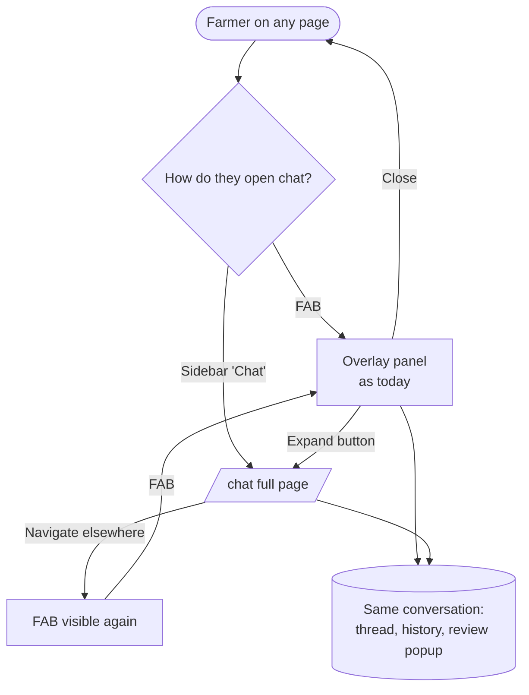

# Proposal

Board issue: **#301**

## Why

Today the chat only exists as a small floating overlay (FAB → 420×640 panel). That works for a quick log entry, but longer conversations get cramped: questions about spend, the daily brief and restored history all compete for a small box on top of whatever page the farmer is on. The chat is also missing from the sidebar, so the one feature farmers use as "the quickest way in" has no place in the main navigation.

## What Changes

- New **dedicated chat page** at `/chat` (auth-guarded): the same chat panel, laid out full height inside the main content area.
- New **"Chat" entry in the sidebar** (`bi-chat-dots` icon, same style as the other nav links).
- The **floating chat button and overlay stay** exactly as today on every other page.
- Overlay header gets an **"Open full page"** (expand) button that goes to `/chat`, carrying the conversation with it.
- **One conversation, two surfaces**: the overlay and the page share the same thread, busy state, history and review popup. Moving between them never loses or reloads messages.
- On `/chat` the floating button is hidden, and an open overlay closes, so the chat is never shown twice.

### End to end

## Capabilities

### New Capabilities
- `assistant-chat-surfaces`: where and how the farmer reaches the chat (overlay, full page, sidebar entry) and that both surfaces share one conversation.

### Modified Capabilities
<!-- None: history, brief, routing and answers behave as specified today. -->

## Impact

- **Frontend only** (`projects/home`): `app.routes.ts`, `layout/app-layout`, `layout/sidebar`, `features/chat-bot` (container, panel header, new page component), i18n keys in en/hi/mr, e2e selectors if any change.
- **Backend**: none. No API or contract change.

## Non-Goals

- Multiple conversations / thread list, search in chat.
- Changing chat behaviour (routing, brief, history, review flow).
- Dragging, resizing or docking the overlay.
- Showing the chat on public (logged-out) pages.
