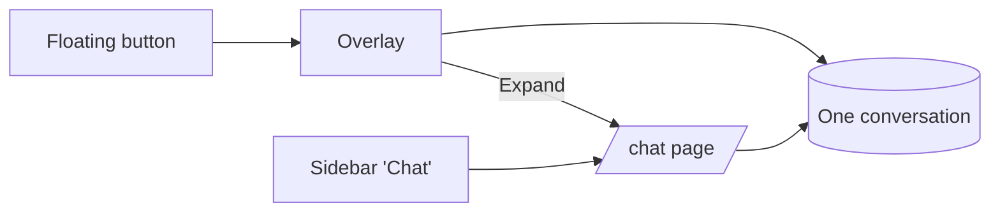

# Spec Delta

## Purpose

Defines where a signed-in farmer can use the assistant chat — a floating overlay on any page, or a dedicated full page reachable from the sidebar — and guarantees both show one shared conversation.

## ADDED Requirements

### Requirement: Dedicated chat page
The system SHALL provide an auth-guarded `/chat` route that shows the chat panel filling the main content area.

#### Scenario: Open the page
- **WHEN** a signed-in farmer navigates to `/chat`
- **THEN** the chat panel is shown full height with the saved history and composer

#### Scenario: Signed out
- **WHEN** a signed-out visitor opens `/chat`
- **THEN** they are redirected to login, as for other protected pages

### Requirement: Sidebar chat entry
The sidebar SHALL include a "Chat" link with a chat icon that navigates to `/chat` and is highlighted while on that page.

#### Scenario: Navigate from sidebar
- **WHEN** the farmer taps "Chat" in the sidebar
- **THEN** the app navigates to `/chat` and the link shows as active

### Requirement: Overlay remains available
The floating chat button and overlay panel SHALL keep working on every authenticated page except `/chat`.

#### Scenario: Overlay on another page
- **WHEN** the farmer taps the floating chat button on any page other than `/chat`
- **THEN** the overlay panel opens as it does today

#### Scenario: No duplicate chat on the page
- **WHEN** the farmer is on `/chat`
- **THEN** the floating chat button is hidden and no overlay is shown

### Requirement: Expand overlay to full page
The overlay panel SHALL offer an expand action that opens `/chat`.

#### Scenario: Expand
- **WHEN** the farmer taps expand in the overlay
- **THEN** the overlay closes and `/chat` opens with the same messages

### Requirement: One shared conversation
The overlay and the page SHALL show the same conversation state (messages, pending entry, busy state, review popup) without reloading it when switching between them.

#### Scenario: Continue across surfaces
- **WHEN** the farmer starts an entry in the overlay, expands to `/chat` and answers the next question there
- **THEN** the entry continues from where it was and Review & Save opens the same review popup

#### Scenario: Logout clears
- **WHEN** the farmer logs out and another farmer logs in
- **THEN** the previous farmer's conversation is not shown
