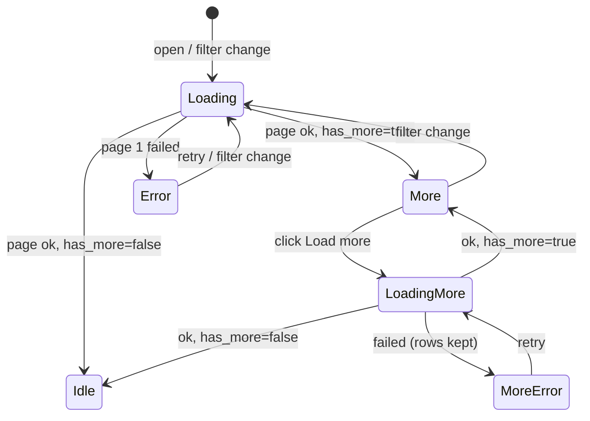

# Design

## Context

Observed today (see proposal.md for motivation):

- `GET /activities` (`routers/activities.py`) has two code paths: with no params it returns every
  row via `activity_repo.list_all`; with any param it applies `status`/`crop_id`/`sort`/`limit`
  (max 100) and returns `{ items }` only — no cursor, so a limited call cannot be continued.
- `GET /activities/expenses` returns every expense, no `limit`. The per-activity
  `GET /activities/{id}/expenses` already paginates with an `updated_at:id` cursor and returns
  `{ items, cursor, has_more }`; this design reuses that shape.
- Client: one app-wide cache (`ActivityService.activities()/expenses()`) is filled by
  `ActivitiesApiService.getActivities/getExpenses` with a single full request. Timeline, reports,
  home, create form and crop dashboard all read it, so it must keep holding the full history.
- The list page filters status/sort/crop on the server but season/field/type and the `cost` sort
  in the browser, over whatever was loaded. With paging, those would silently apply to only the
  loaded rows.
- `0006_perf_indexes` already provides `activity(farmer_id, updated_at DESC, id DESC) WHERE
  deleted_at IS NULL` and `activity_expense(activity_id)`.

## Goals / Non-Goals

**Goals:**
- Bounded response size and server work per request, for activities and expenses.
- Correct filters and sorts across pages (no client-side narrowing of a partial set).
- No behaviour change for pages that read the shared cache.
- A rollout order in which no deployed client ever receives silently truncated data.

**Non-Goals:**
- Replacing the shared cache, per-page resolvers, or server aggregates for reports/home.
- Total counts (would need a second `COUNT` query per request; the UI does not need it).

## Decisions

**1. Keyset (cursor) pagination, not offset.** Offsets repeat or skip rows when activities are
created or edited between requests, and cost grows with the offset. Keyset on the sort key plus
`id` gives a total order and stable traversal. *Alternative:* `OFFSET/LIMIT` — rejected for the
drift above.

**2. Opaque cursor carrying the sort.** The cursor is base64url JSON `{ s, k, id }`: sort name,
last row's sort key (ISO timestamp, date string or decimal string, or null) and id. A cursor whose
`s` differs from the request's sort, or that fails to decode, is a 422. *Alternative:* plain
`updated_at:id` like the expense endpoint — insufficient for date/cost orders.

**3. Sort keys and null handling.**

| sort | order by | keyset predicate (after last row `(k, id)`) |
|---|---|---|
| default | `updated_at DESC, id DESC` | `(updated_at, id) < (k, id)` |
| `date_desc` | `date DESC NULLS LAST, id DESC` | `date < k OR (date = k AND id < id) OR date IS NULL` when `k` set; `date IS NULL AND id < id` when `k` is null |
| `date_asc` | `date ASC NULLS LAST, id ASC` | same with `>` |
| `cost_desc` | `cost DESC, id DESC` | `cost < k OR (cost = k AND id < id)` |

`date` is an ISO `YYYY-MM-DD` string, so string comparison orders correctly. The date sorts gain an
`id` tie-break, which the current query lacks (today ties are returned in arbitrary order).

**4. `cost_desc` via a correlated scalar subquery.** `coalesce((SELECT sum(amount) FROM
activity_expense e WHERE e.activity_id = activity.id AND e.deleted_at IS NULL), 0)`, evaluated only
for the caller's rows and served by `idx_activity_expense_activity_id`. *Alternative:* a
denormalised `total_cost` column — rejected: needs triggers/backfill for a sort used rarely.

**5. One query path.** The "no params" fast path is removed; every call builds the same statement,
fetches `limit + 1` rows and sets `has_more`/`cursor` (as `list_activity_expenses` does). Default
`limit` is a single constant, `None` (unlimited) until phase 3, then 100.

**6. Server-side `season`, `land_id`, `activity_type_id` filters** replace the list page's
browser-side narrowing. The list page's dropdowns bind to ids (activity type by reference id, field
by land id), consistent with the `reference-data-ids` capability.

**7. Client paging helper.** `ActivitiesApiService` gets one private `fetchAllPages(path)` that
follows `cursor` with `limit=100`, stops when `has_more` is false or absent, and caps at 200 pages as
a runaway guard. `getActivities`/`getExpenses` use it, so `ActivityService` and its generation
guard (`mutationGeneration`, `inFlightLoad`) are unchanged: a mutation during paging discards the
whole load, as it does now.

**8. List page state.** `ActivityListService.loadPage(filters, cursor?)` returns
`{ items, cursor, hasMore }`. The component holds `activities`, `cursor`, `hasMore`, `loadingMore`
and `loadMoreError` signals; any filter/sort change clears them and fetches page 1 (page size 20);
stale responses are ignored via a request token. "Load more" appends; on error rows stay and the
button becomes a retry.

**9. Accessibility.** Appended rows do not move focus; the button keeps focus and keeps its
position. A polite live region announces "N more activities loaded" and, at the end, "All
activities shown". The button is a native `<button>` with the loading state in `aria-busy`.

**10. i18n.** `activityList.showingCount` becomes `Showing {{shown}} recorded operations` (en/hi/mr);
new keys `loadMore`, `loadingMore`, `allLoaded`, `loadMoreError`. The "of {{total}}" wording is
dropped because no total is known.

## Risks / Trade-offs

- **Old cached frontend meets a capped default** → phase 3 (cap) ships only after phase 2 is live;
  phase 1 keeps the default unlimited, so a mixed deployment is always safe.
- **Keyset bugs with nulls/ties** → property-style tests traverse every sort over data with null
  dates, duplicate dates and equal costs, asserting each row appears exactly once.
- **Cursor key precision** (timestamps with microseconds, decimals) → cursor stores the exact
  ISO string / decimal string; tests round-trip it.
- **Shared cache still downloads everything** (by design, non-goal) → the request count rises (3×
  100 rows instead of 1×500) but each response is smaller and the server stops building one huge
  payload; real savings come from the follow-up that loads per page.
- **Cost sort scans the farmer's activities** per page (correlated subquery) → bounded by one
  farmer's history and indexed; revisit if a farmer has tens of thousands of rows.

## Migration Plan

1. **PR 1 — API (additive).** New params, response fields and sorts; default unlimited. No
   client change needed. Rollback: revert.
2. **PR 2 — client.** Paged cache loading, list page "Load more", server-driven filters, i18n.
   Works against old and new API. Deploy, then confirm the live site serves it (GitHub Pages build).
3. **PR 3 — cap.** Default `limit` 100 for both endpoints; update OpenAPI/contracts. Rollback: set
   the constant back to `None`.
