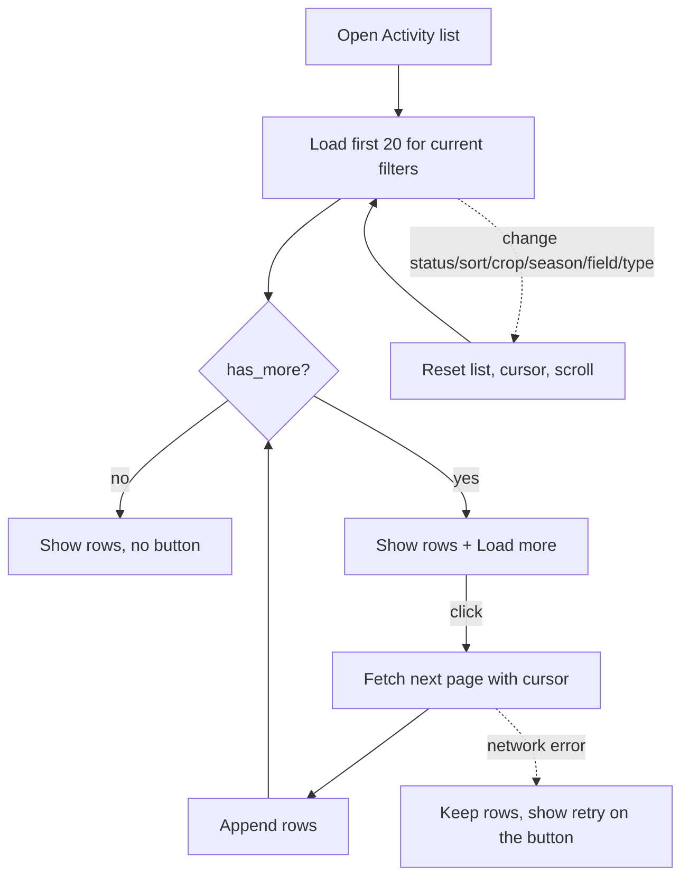

# Proposal

Issues: #313 (unbounded activity/expense downloads), #315 (activity list renders every row).
Parent epic: #320. Sub-issues (one PR each): #321 API pagination, #322 client paging + list page, #323 default page cap.

## Why

Every page downloads all of a farmer's activities (~160 kB for 500) and all expenses (~66 kB), and
the list page renders every row (10,668 DOM nodes for 500 activities). Cost grows linearly with
the farm's history, `GET /activities/expenses` ignores `limit`, and the server serialises the
whole table on each call. This hurts most on the slow, low-end phones this app targets.

## What Changes

- **API:** `GET /activities` and `GET /activities/expenses` gain cursor pagination (`cursor`,
  `limit` ≤ 100) and return `{ items, cursor, has_more }`, matching the existing
  `GET /activities/{id}/expenses`. `GET /activities` also gains server-side filters the list page
  currently applies in the browser (`season`, `land_id`, `activity_type_id`) and a
  `cost_desc` sort, so filtering and sorting are correct across pages.
- **Shared data cache (client):** the app-wide activity and expense cache loads by following
  cursors in pages of up to 100 instead of one giant response. App behaviour is unchanged.
- **Activity list page:** shows 20 rows, then a "Load more" button appends the next page for the
  current filters. The DOM size stays bounded until the user asks for more.
- **Rollout in three PRs** so a cached old frontend never sees silently truncated data: (1) API
  pagination, still unlimited by default; (2) client paging + list page; (3) flip the API default
  to a capped page once the new client is live.
- **BREAKING (phase 3 only):** `GET /activities` and `GET /activities/expenses` with no `limit`
  return at most 100 items (was: everything). Clients must follow `has_more`/`cursor`.

## Capabilities

### New Capabilities
- `activity-list-pagination`: cursor-paginated, filterable, sortable activity and expense list
  endpoints, and the default page cap.
- `activity-list-paging-ui`: the activity list page's page-at-a-time rendering with "Load more",
  and the shared cache's paged loading.

### Modified Capabilities
<!-- None: no existing spec covers activities or expenses listing. -->

## Non-Goals

- Per-page data loading: pages keep reading the shared cache, so timeline, reports, home and the
  create form still see the full history. Moving them to resolvers and server aggregates is a
  follow-up.
- Total row counts, numbered pages or infinite scroll.
- Pagination of crops, lands or farms.
- Changes to `/activities/{id}/expenses` (already paginated) or to the summary endpoint.

## Impact

- Backend: `routers/activities.py` (list endpoints, cursor helpers), tests; regenerated
  `openapi.json` and frontend contracts.
- Frontend: `core/api/activities-api.service.ts`, `features/activity/activity.service.ts`,
  `features/farm-activity/list/*`, i18n strings (`en`, `hi`, `mr`).
- No migration: the `0006_perf_indexes` indexes already serve the keyset queries.

## User journey (activity list)

