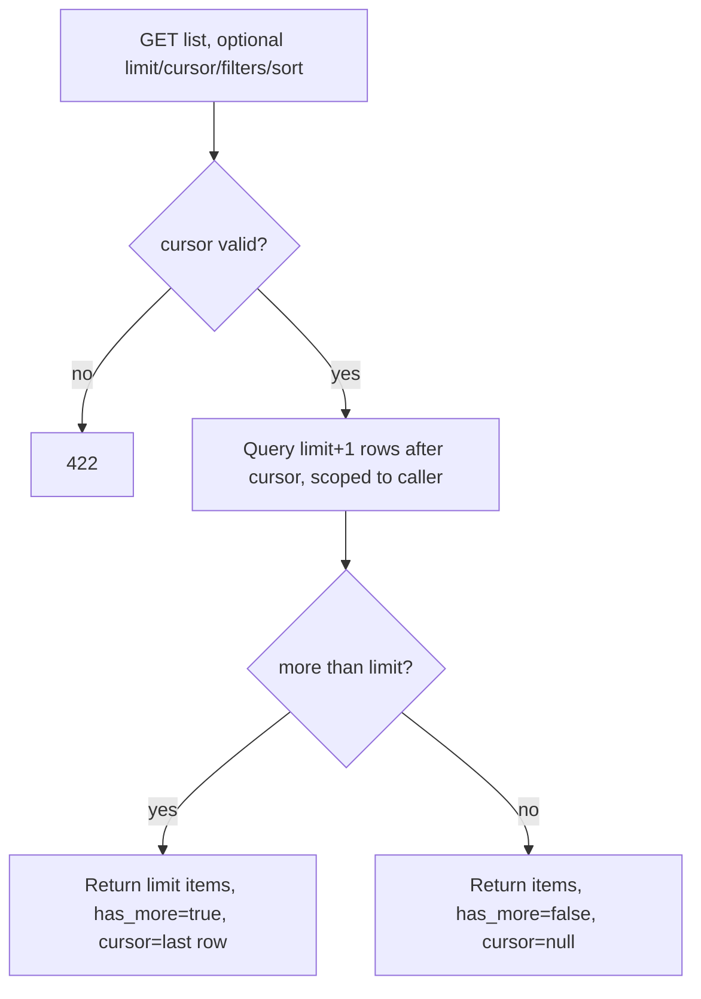

## Purpose
Activity and expense lists are returned a page at a time with a stable cursor, so response size and server work stay bounded however long a farmer's history grows. Filters and sort orders are applied by the server, so they stay correct across pages.

## ADDED Requirements

### Requirement: Paginated activity list
`GET /api/v1/activities` SHALL accept `limit` (1–100) and an opaque `cursor`, and SHALL return `{ items, cursor, has_more }`, where `cursor` is non-null exactly when `has_more` is true. Following `cursor` until `has_more` is false SHALL return every matching activity exactly once, with no gaps or repeats, for each supported sort order.

#### Scenario: First page
- **WHEN** a farmer with 250 activities requests `GET /activities?limit=100`
- **THEN** 100 items are returned with `has_more: true` and a non-null `cursor`

#### Scenario: Last page
- **WHEN** the final page is requested with the cursor from the previous page
- **THEN** the remaining items are returned with `has_more: false` and `cursor: null`

#### Scenario: Complete traversal
- **WHEN** a client follows the cursor from the first page to the last for any sort order
- **THEN** the concatenated items equal the full result set, each activity appearing once

#### Scenario: Activity changed mid-traversal
- **WHEN** an activity is created or updated while a client is paging
- **THEN** no already-returned activity is returned again, and the traversal terminates

#### Scenario: Invalid cursor
- **WHEN** `cursor` is malformed or was issued for a different sort order
- **THEN** the response is 422 and no data is returned

#### Scenario: Tenant isolation
- **WHEN** another farmer's activities exist
- **THEN** they never appear in any page, and a cursor from one farmer never exposes another's rows

### Requirement: Stable sort orders
`GET /activities` SHALL support the default order (most recently updated first) and `sort=date_asc`, `sort=date_desc` and `sort=cost_desc`. Ties SHALL be broken by id so the order is total. Activities without a date SHALL sort last for the date orders; activities without expenses SHALL count as zero cost.

#### Scenario: Date order with missing dates
- **WHEN** sorted by `date_desc`, some activities have no date
- **THEN** dated activities come first, newest first, followed by undated ones in id order

#### Scenario: Cost order
- **WHEN** sorted by `cost_desc`
- **THEN** activities are ordered by the sum of their non-deleted expenses, highest first, ties by id

### Requirement: Server-side filters
`GET /activities` SHALL support the existing `status` (repeatable) and `crop_id` filters plus `season`, `land_id` and `activity_type_id`, combined with AND and applied before pagination.

#### Scenario: Filter applies across pages
- **WHEN** 300 activities exist and 120 match `activity_type_id=3`
- **THEN** following the cursor with that filter returns exactly those 120

### Requirement: Paginated expense list
`GET /api/v1/activities/expenses` SHALL accept `limit` (1–100) and `cursor` and return `{ items, cursor, has_more }` ordered by most recently updated first with id tie-break, under the same completeness and isolation guarantees, excluding soft-deleted expenses and expenses of deleted activities.

#### Scenario: Limit honoured
- **WHEN** a farmer with 250 expenses requests `GET /activities/expenses?limit=50`
- **THEN** 50 items are returned with `has_more: true`

#### Scenario: Deleted expense excluded
- **WHEN** an expense has been deleted
- **THEN** it appears on no page

### Requirement: Default page cap
After the client rollout completes, requests without `limit` SHALL return at most 100 items with `has_more` set accordingly, instead of the whole list.

#### Scenario: No limit given
- **WHEN** a farmer with 250 activities requests `GET /activities` with no parameters
- **THEN** 100 items are returned with `has_more: true`

#### Scenario: Short history unaffected
- **WHEN** a farmer has 40 activities and requests `GET /activities`
- **THEN** all 40 are returned with `has_more: false`
