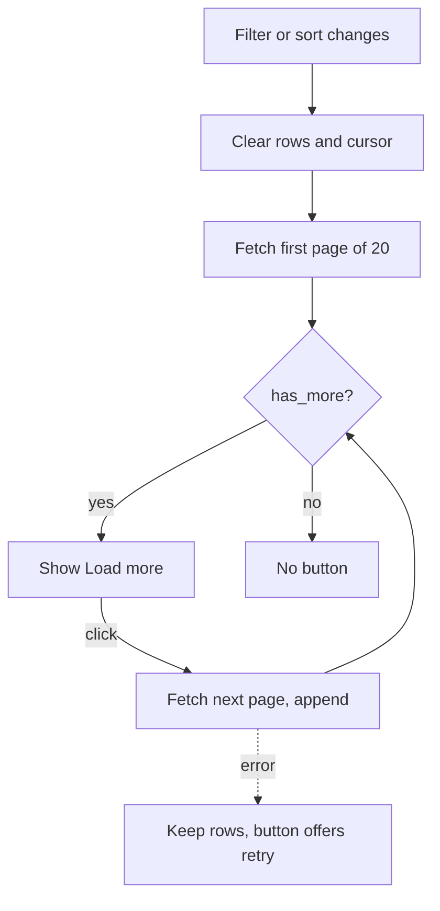

## Purpose
The app keeps working with a farmer's full history while each request stays small, and the activity list never renders more rows than the farmer has asked to see.

## ADDED Requirements

### Requirement: Shared cache loads by pages
The app-wide activity and expense cache SHALL load by following the API cursor in pages of up to 100 until `has_more` is false, and SHALL end up with the same contents as a single full load. A response without `has_more` SHALL be treated as complete.

#### Scenario: Large history
- **WHEN** the signed-in farmer has 250 activities
- **THEN** the cache is filled by three requests of at most 100 items, and every consumer sees all 250

#### Scenario: Older API
- **WHEN** the API returns a list with no `has_more`
- **THEN** the cache treats it as complete and stops

#### Scenario: Older API that truncated at the page size
- **WHEN** a response has no `has_more` and as many rows as the requested page size (an API that treats `limit` as a cap)
- **THEN** the cache refetches once without a limit so no rows are silently lost

#### Scenario: Write during loading
- **WHEN** the farmer saves or deletes an activity while pages are loading
- **THEN** the stale load is discarded and the cache is reloaded, so the change is not lost or resurrected

#### Scenario: Paging failure
- **WHEN** a page request fails mid-load
- **THEN** the cache keeps its previous contents and the failure is logged, as for a failed full load

### Requirement: Activity list renders page by page
The activity list page SHALL load the first 20 activities for the current filters and, while more exist, show a "Load more" button that appends the next page. The number of rendered rows SHALL equal the number of loaded activities.

#### Scenario: Initial view
- **WHEN** a farmer with 500 activities opens the activity list
- **THEN** 20 activities are shown with a "Load more" button, and about 20 cards are in the DOM

#### Scenario: Load more
- **WHEN** the farmer activates "Load more"
- **THEN** the next 20 are appended below, existing rows stay, and focus remains on the button

#### Scenario: End of list
- **WHEN** the last page has been loaded
- **THEN** the button is removed and a screen-reader-visible message says all activities are shown

#### Scenario: Load more fails
- **WHEN** fetching the next page fails
- **THEN** loaded rows stay visible, an inline error appears and the button offers retry

### Requirement: Filters and sorting are server-driven
Status, sort, crop, season, field and activity-type filters on the list page SHALL be sent to the API so they apply to the whole history, and changing any of them SHALL reset the list to its first page. Sorting by cost SHALL use the server's `cost_desc` order.

#### Scenario: Filter beyond the loaded page
- **WHEN** only 20 of 500 activities are loaded and the farmer picks an activity type that matches 35 of the 500
- **THEN** the first 20 matching activities are shown, and "Load more" reveals the remaining 15

#### Scenario: Filter change resets
- **WHEN** the farmer changes any filter or the sort order
- **THEN** previously loaded rows are cleared and the first page for the new settings is fetched

#### Scenario: Cost sort
- **WHEN** the farmer sorts by cost
- **THEN** the list is ordered by total expense across all activities, not just the loaded rows

### Requirement: Count text reflects what is loaded
The list header SHALL state how many activities are shown and SHALL NOT claim a total it does not know.

#### Scenario: More available
- **WHEN** 20 are shown and more exist
- **THEN** the header reads "Showing 20 recorded operations" style text without a total, in every supported language
