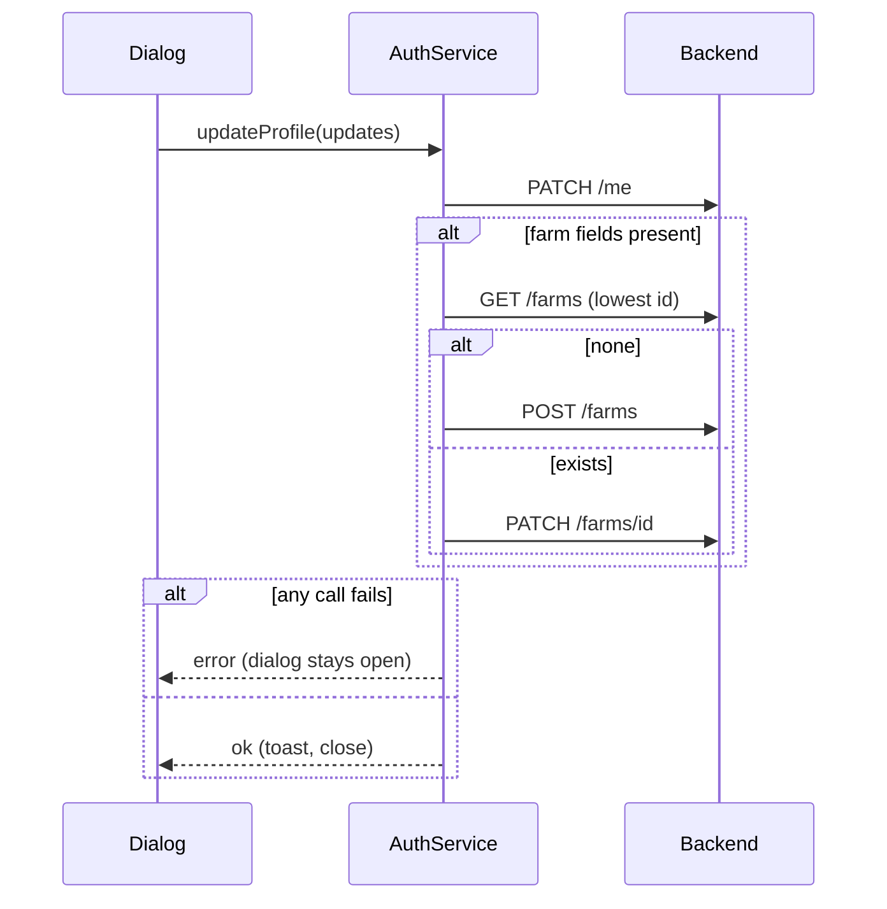

## Context

The dialog calls `AuthService.updateProfile`, which merges into an in-memory signal; `saveFarmer` sends only three fields to `PATCH /me`. Farm data has a backend home (`Farm`, `farm_crop`) already used by the Lands feature, but profile never writes to it and never reads it back. See proposal.md.

## Goals / Non-Goals

**Goals:** persist and hydrate with the existing tables; no migration.
**Non-Goals:** multi-farm UI, role-based permissions.

## Decisions

1. **Default farm = lowest id.** Today `GET /farms` is ordered by `updated_at desc`, so `items[0]` changes after every edit. One shared resolver (used by profile and Lands) picks the lowest id. Alternative: a `is_default` column — rejected, needs a migration for no current benefit.
2. **Extend `FarmUpdate`/`FarmRead`** with `setup_completed` and `crop_catalog_ids`. Crops use replace semantics, deduped and validated against the catalog. Alternative: separate crops endpoints — rejected, extra round trips and partial states.
3. **`user_role` on `FarmerUpdate`** as an enum of the 7 values. A label only.
4. **Async `updateProfile`**: split updates into farmer fields (`/me`) and farm fields (default farm). In-memory state is updated only after success. If there is no farm, create it with the first save's fields.
5. **Hydrate on login/restore**: after `/me`, load the default farm and map to the registration data used by the profile. The default name "My Farm" is not shown as a user-entered farm name.
6. **Dialog**: `saving` signal disables Save, error banner on failure, stays open.

## Risks / Trade-offs

- Concurrent first saves create two farms → lowest-id rule still resolves consistently.
- `/me` succeeds, farm write fails (partial) → error shown; retry is idempotent since the full form is resent.
- Existing farms may hold "My Farm" default name → treated as unset in the form.

## Migration Plan

Backend PR first (additive, backward compatible), then client PR. Rollback: revert client; backend fields are optional.
