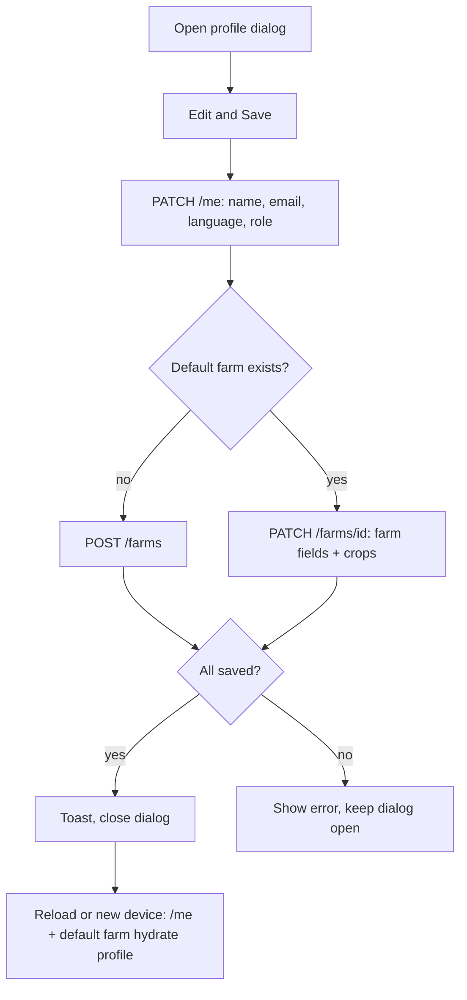

## Why

Profile and farm settings look saved but are not: the edit dialog updates only in-memory state, and `PATCH /me` receives just name, email and language. After a reload or on another device, farm name, area, location, water source, crops, role and the "setup completed" flag are all blank again (#327, relates to #223).

## What Changes

- Backend: the farm update accepts `setup_completed` and `crop_catalog_ids` (replaces the farm's crops via the existing `farm_crop` table); farm reads include `crop_catalog_ids`.
- Backend: profile update (`PATCH /me`) accepts `user_role` (label only, restricted to the app's role list).
- Client: saving the profile dialog writes account fields to `/me` and farm fields to the farmer's default farm (created on first save if none), waits for the result, and reports failure instead of closing silently.
- Client: after sign-in or session restore, farm fields are loaded from the default farm so the profile shows what was saved.
- Client: phone becomes read-only in the dialog (it is the sign-in identity); the "Other" crop option is removed (no catalog row).
- Default farm is one shared rule: the lowest-id farm of the farmer.

## Capabilities

### New Capabilities
- `farm-profile-persistence`: profile and farm settings persist to the backend and reload across sessions and devices.

### Modified Capabilities
<!-- none -->

## Impact

- Backend: `schemas/farm.py`, `schemas/farmer.py`, `routers/farms.py`, `routers/me.py`, farm repository; no migration. OpenAPI export + client contracts regenerated.
- Frontend: `AuthService.updateProfile`, `FarmerProfileApiService`, `LandsApiService` default-farm resolution, `profile-edit-dialog.component`.
- Tracked in #327 with two sub-issues (API, client).

## Non-goals

- Using `user_role` for permissions; editing phone; multi-farm profile switching.
- Security hardening and other improvements (deferred by the user).
- Importing "Other" crops as free text.

## User journey

