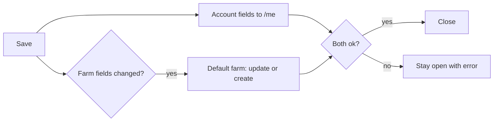

## Purpose
Profile and farm settings entered in the profile dialog are stored on the backend, so they survive reloads and appear on any device.

## ADDED Requirements

### Requirement: Farm settings persist to the default farm
Saving farm details (name, area, unit, location, water source, irrigation, farming method, setup completed, primary crops) SHALL store them on the farmer's default farm, which is the farmer's lowest-id farm. If the farmer has no farm, one SHALL be created on first save.

#### Scenario: Save then reload
- **WHEN** a farmer saves farm name "Green Acres" with 3 primary crops and reloads the app
- **THEN** the profile shows "Green Acres" and the same 3 crops

#### Scenario: First save creates the farm
- **WHEN** a farmer with no farm saves farm details
- **THEN** a farm holding those details exists afterwards

#### Scenario: Another device
- **WHEN** the same farmer signs in elsewhere
- **THEN** the same farm details are shown

### Requirement: Primary crops are stored by catalog id
The farm SHALL hold its primary crops as catalog ids. Updating them SHALL replace the full set, ignore duplicates and reject unknown ids.

#### Scenario: Replace crops
- **WHEN** a farm with crops [1,2] is updated with `crop_catalog_ids` [2,3]
- **THEN** the farm's crops are exactly [2,3]

#### Scenario: Unknown crop id
- **WHEN** an update contains a crop id not in the catalog
- **THEN** the request is rejected as invalid and the farm is unchanged

#### Scenario: Omitted crops
- **WHEN** an update does not include `crop_catalog_ids`
- **THEN** the farm's crops are unchanged

### Requirement: Role persists as a label
The profile update SHALL accept a role from the app's role list (farmer, farm_owner, agronomist, farm_worker, student, researcher, gardener) and return it on later reads. It SHALL NOT affect access.

#### Scenario: Valid role
- **WHEN** a farmer saves role "agronomist" and reloads
- **THEN** the profile shows "agronomist"

#### Scenario: Invalid role
- **WHEN** an update contains an unlisted role
- **THEN** the request is rejected as invalid

### Requirement: Phone is read-only in the profile
The profile dialog SHALL show the phone number but not allow editing it.

#### Scenario: Phone field
- **WHEN** the profile dialog opens
- **THEN** the phone is displayed read-only and is not sent in the save

### Requirement: Save reports its outcome
The dialog SHALL stay open with a saving state until all writes finish, show an error if any fail, and close with a success message only when all succeed.

#### Scenario: Failure
- **WHEN** the farm update fails
- **THEN** the dialog stays open, an error is shown, and the entered values are kept

#### Scenario: Double submit
- **WHEN** Save is pressed while a save is in progress
- **THEN** no second save is started
