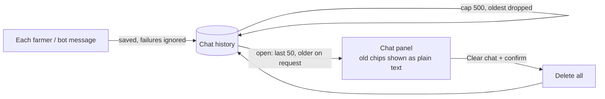

## Purpose
Keeps the farmer's conversation with the assistant so it survives closing the panel, reloading and switching devices, and lets the farmer erase it.

## Requirements

### Requirement: Messages are persisted per farmer
The system SHALL store each farmer and bot message (role, text, timestamp) against the authenticated farmer, and SHALL NOT expose one farmer's messages to another.

#### Scenario: Message stored
- **WHEN** the farmer sends a message and the bot replies
- **THEN** both messages are retrievable, in order, for that farmer only

### Requirement: History is restored on open
When the chat opens the system SHALL show the most recent messages (up to 50) and SHALL load older ones on request.

#### Scenario: Reopen after reload
- **WHEN** the farmer reloads the app and opens the chat
- **THEN** the previous conversation is shown, newest at the bottom

#### Scenario: Stale interactive elements
- **WHEN** restored bot messages were originally sent with quick-reply chips or a Review & Save action
- **THEN** they are shown as plain text and are not tappable

### Requirement: Farmer can clear history
The system SHALL let the farmer delete their entire chat history, after which none of it is returned.

#### Scenario: Clear
- **WHEN** the farmer confirms "Clear chat"
- **THEN** all their messages are deleted and the chat shows an empty state

### Requirement: Persistence never blocks the chat
A failure to save or load history SHALL NOT prevent the farmer from chatting or logging entries.

#### Scenario: Save fails
- **WHEN** persisting a message fails
- **THEN** the conversation continues and the bot reply is still shown

### Requirement: Bounded retention
The system SHALL keep at most 500 messages per farmer, discarding the oldest first.

#### Scenario: Over the cap
- **WHEN** a farmer's 501st message is stored
- **THEN** their oldest message is removed
