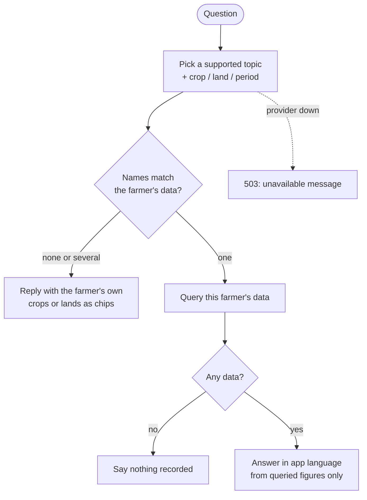

## Purpose
Lets the farmer ask questions about their own recorded farm data and get a short, accurate answer in their language.

## Requirements

### Requirement: Answers come from the farmer's own data
The system SHALL answer a question only from data belonging to the asking farmer, queried by the backend, and SHALL NOT state figures the backend did not compute.

#### Scenario: Spend question
- **WHEN** the farmer asks "how much did I spend on wheat this season?"
- **THEN** the answer states the total of that farmer's non-deleted expenses on activities for their wheat crop(s) in that period
- **AND** the figure equals what the activity summary would report for the same scope

#### Scenario: Another farmer's data
- **WHEN** any question is asked
- **THEN** no data belonging to another farmer is used in the answer

### Requirement: Supported question topics
The system SHALL answer questions about: total and per-category spend (optionally by crop, land, or period), recent activities, pending activities (Scheduled, Draft, In Progress), the farmer's lands and crops, and current weather for a land.

#### Scenario: Pending work
- **WHEN** the farmer asks "what work is pending on Plot 2?"
- **THEN** the answer lists that land's activities whose status is Scheduled, Draft or In Progress

#### Scenario: Weather
- **WHEN** the farmer asks about weather and has a land with coordinates
- **THEN** the answer uses the weather for that land (the only land, or the one named)

### Requirement: Honest empty and ambiguous results
The system SHALL say so plainly when there is no matching data, and SHALL ask which land or crop is meant when a name matches more than one or none.

#### Scenario: No matching data
- **WHEN** the farmer asks about spend on a crop with no recorded expenses
- **THEN** the answer says nothing has been recorded rather than presenting zero as a fact about the farm's costs

#### Scenario: Unknown name
- **WHEN** the question names a land or crop the farmer does not have
- **THEN** the bot replies that it could not find it and offers the farmer's actual lands or crops as quick replies

### Requirement: Answers follow the app language
The system SHALL write answers in the language the client sends (en, hi or mr), falling back to the farmer's preferred language, then English.

#### Scenario: Marathi app language
- **WHEN** the app language is `mr` and the farmer asks a spend question
- **THEN** the answer is in Marathi and figures are unchanged

### Requirement: Failure is visible and never fabricated
If the model provider is unavailable or returns unusable output, the system SHALL return a service-unavailable result and the bot SHALL show its existing unavailable message; it SHALL NOT invent an answer.

#### Scenario: Provider down
- **WHEN** the provider is unavailable during a question
- **THEN** the client receives a 503 and shows the "temporarily unavailable" message
